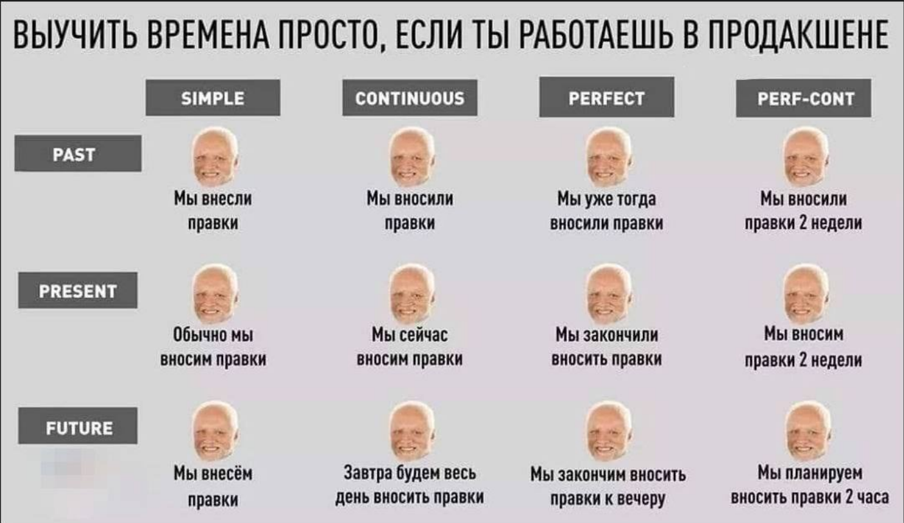

<!--Заголовки-->
# Заголовок 1
## Заголовок 2
### Заголовок 3
#### Заголовок 4
##### Заголовок 5
###### Заголовок 6

Заголовок 1
=
Заголовок 2
-

<!--Списки-->
* пункт списка
+ пункт списка
- пункт списка

1. пункт списка
2. пункт списка
3. пункт списка

<!--Линии-->
***

---

___

<!--Перенос строки 2 пробелами-->
Velit ut autem et et ea erat odio feugiat rebum consectetuer amet eos et nonumy dolor est molestie consectetuer lorem possim <!----> 
dolor gubergren sed magna et invidunt nibh vero duis

<!--Курсивный  +нижние подчеркивания-->
*Привет*

<!--Жирный  +нижние подчеркивания-->
**Привет**

<!--Жирный-Курсивный  +нижние подчеркивания-->
***Привет***

<!--Выделить что то в блок-->
`
Привет, -
как
дела.
`

<!--Выделить что то в блок с сохранением абзацов-->
```
Привет, -
как
дела.
```

<!--Добавить цитату-->
>Какая-то цитата, но ее пока нету.

<!--Добавить ссылку-->
[Ссылка](https://github.com/)

<!--Добавить изображение-->



<!--Картинка ссылка-->
[](https://github.com/)

<!--Таблица-->
Item      | Value  | Read
:-------- |:-----: |----:
Computer  | 1600   | 3
Phone     | 12     | 2
Pipe      | 1      | 1

